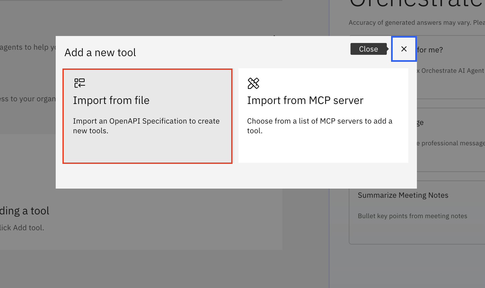
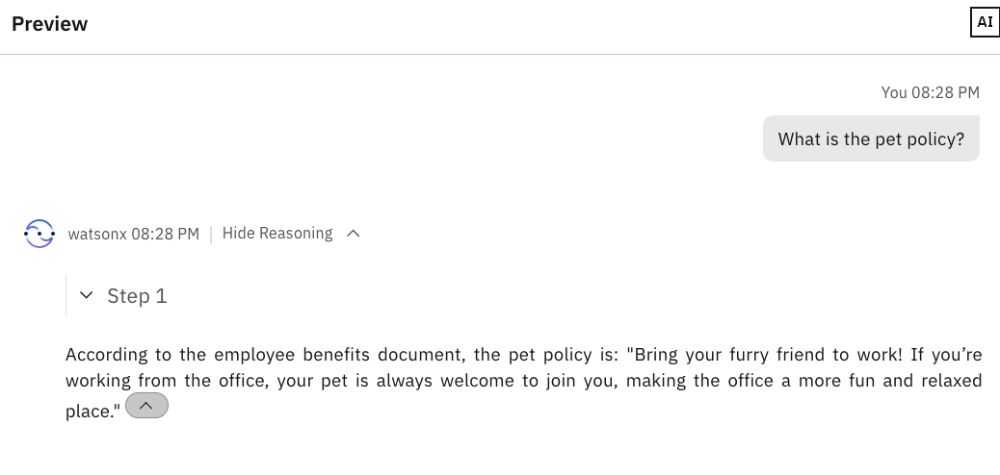
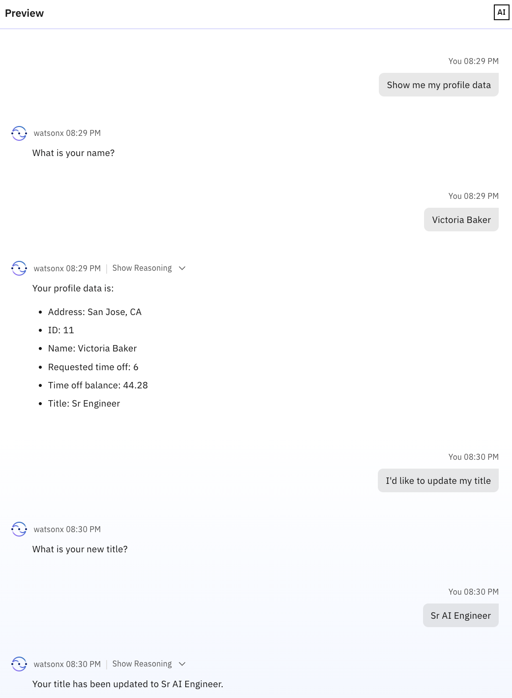
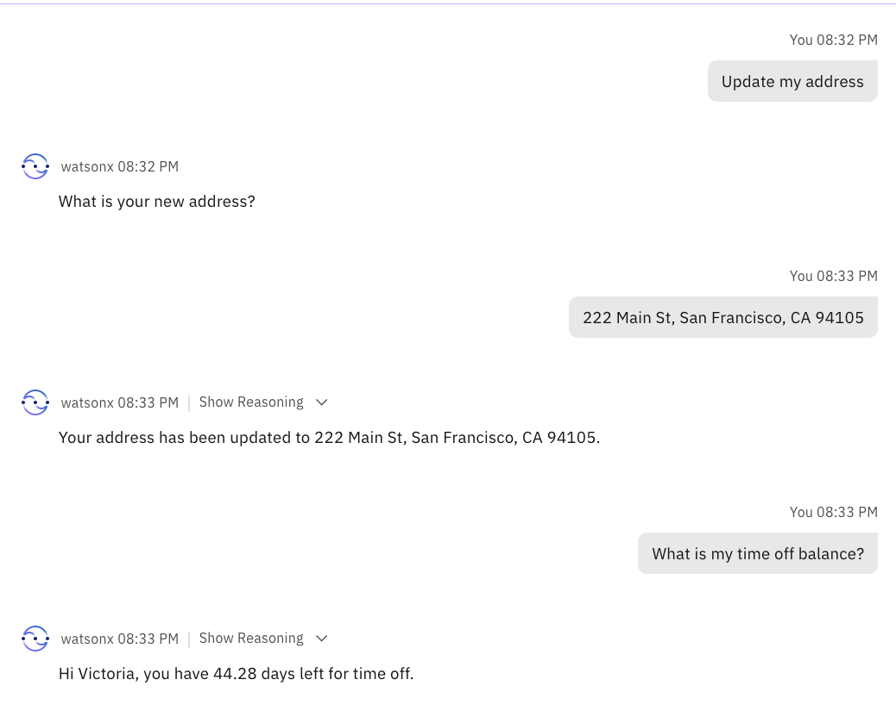

# 🧑‍💼 AskHR: Automate HR tasks with Agentic AI

## Table of Contents

- [Description of the use case](#description-of-the-use-case)
- [Architecture](#architecture)
- [Instructions](#instructions)
  - [Access your environment](#access-your-environment)
  - [Open Agent Builder](#open-agent-builder)
  - [Create HR Agent](#create-hr-agent)
  - [Test HR Agent in Preview](#test-hr-agent-in-preview)
  - [Adjust the Instructions of the Agent and keep exploring](#adjust-the-instructions-of-the-agent-and-keep-exploring)
  - [Deploy and make your Agent available](#deploy-and-make-your-agent-available)
- [Conclusion](#conclusion)


## Description of the use case

This use case targets developing and deploying an AskHR agent leveraging IBM watsonx Orchestrate, as depicted in the provided architecture diagram. This agent will empower employees to interact with HR systems and access information efficiently through conversational AI. 

In this lab we will build an HR agent in watsonx Orchestrate, leveraging tools and external knowledge to connect to a simulated Human Capital Management System. This agent retrieves relevant information from documents to answer user queries and  allows users to view and manage their profiles.

## Architecture


## Instructions

### **Access your environment**

Access your environment (URL provided by your instructor) and enter the workshop password provided by your instructor. 

<div align="center">
  
</div>

To access IBM Cloud, click on the IBM Cloud Login.

<div align="center">

</div>

### Open Agent Builder

- Log in to IBM Cloud (cloud.ibm.com). Navigate to top left hamburger menu, then to Resource List. Open the AI/Machine Learning section. You should see a **watsonx Orchestrate** service, click to open.

  

- Click the "Launch watsonx Orchestrate" button.

   

- Welcome to watsonx Orchestrate. Open the hamburger menu, click on the down arrow next to **Build**.  Then click on **Agent Builder**:

   

### Create HR Agent
1. Click on **Create agent +**:

   

1. Select **Create from scratch**, give your agent a name, e.g. `HR Agent`, and fill in the **Description** as shown below: 

   ```
   You are an agent who handles employee HR queries.  You provide short and crisp responses, keeping the output to 200 words or less.  You can help users check their profile data, retrieve latest time off balance, update title or address, and request time off. You can also answer general questions about company benefits.
   ```  
   Click on **Create**:

   
<!--   
1. Click on the down arrow against **Model**. Select Model "llama-3-405b-instruct"

   
-->   

The natural language description of an agent is important as it is leveraged by the agentic solution to route user messages to the right agent skilled in addressing the request. For more details, please review the [Understanding the description attribute for AI Agent](https://www.ibm.com/docs/en/watsonx/watson-orchestrate/base?topic=agents-recommendations-agent-descriptions) documentation.

**watsonx Orchestrate** supports creating an agent from scratch or from a template which involves browsing a catalog of existing agents and using attributes of another agent as a template for the new agent. For this lab, you will be creating agents from scratch.

> **Note:** To discover all the pre-built agents and tools in **watsonx Orchestrate**, please consult the [catalog of pre-built agents and tools](https://www.ibm.com/docs/en/watsonx/watson-orchestrate/base?topic=discovering-catalog) documentation.

Next, you will go through the process of configuring your agent. The Product Agent page is split in two halves:
- The right half is a preview chat interface that allows you to test the behavior of your agent.
- The left half of the page consits of five key sections that you can use to configure your agent.

<div align="center">
  
</div>

1. Select **Default** in **Agent style** section.

   

      > **Note:** For more details, Please consult the [Choosing a reasoning style for your agent](https://www.ibm.com/docs/en/watsonx/watson-orchestrate/base?topic=agents-choosing-style-agent) documentation to understand the difference and how it affects the agent's behavior.
  
1. Scroll down the screen to the **Knowledge** section.
   Click on **Choose knowledge**.
   
   

      - **Knowledge**: The Knowledge section is where you can add knowledge to the agent. Adding knowledge to agents plays a crucial role in enhancing their conversational capabilities by providing them with the necessary information to generate accurate and contextually relevant responses for specific use cases. You can directly upload files to the agent or connect to a Milvus or Elasticsearch instance as a content repository. Through this Knowledge interface, you can enable your AI agents to implement the Retrieval Augmented Generation (RAG) pattern which is a very popular AI pattern for grounding responses to a trusted source of data such as enterprise knowledge base.

      > **Note:** For more details, please consult the [Adding knowledge to agents](https://www.ibm.com/docs/en/watsonx/watson-orchestrate/current?topic=agents-adding-knowledge) documentation.
  
1. Select **Upload files**.
   Click on **Next**.
   
   
     
1. Download the [Employee Benefits.pdf](/ask-hr/assets/Employee-Benefits.pdf) onto your system, then upload the file here. You can download the pdf by clicking on [Employee Benefits.pdf](/ask-hr/assets/Employee-Benefits.pdf) and then click on download icon in opened page as shown in image below.
      

      
   Once you upload the file, Click on **Next**.

   

1. Add the **Name** "Employee Benefits" to the file. Also, copy the following description into the **Description** section and then click on **Save**:

   ```
   This knowledge base addresses the company's employee benefits, including parental leaves, pet policy, flexible work arrangements, and student loan repayment.
   ```
   
   <div align="center">
     
   </div>

1. Scroll down to the **Toolset** section. Click on **Add tool +**:

   

    - **Toolset**: While Knowledge is how you empower agents with a trusted knowledge base, then Toolset is how you enable agents to act by providing them with Tools and Agents. Agents can accomplish tasks by using Tools or can delegate tasks to other Agents which are deeply skilled in such tasks.

    - For Tools, you can use the [**watsonx Orchestrate Agentic Development Kit (ADK)**](https://developer.watson-orchestrate.ibm.com/) to develop and upload Python and OpenAPI tools to a specific **watsonx Orchestrate** instance which you can then add to the agents.

    - Additionally, **watsonx Orchestrate** also supports the addition of [Model Context Protocol (MCP)](https://developer.watson-orchestrate.ibm.com/mcp_server/wxOmcp_overview) tools. MCP is a standard for connecting AI Agents to systems where data lives including content repositories, business tools and development environments. MCP is becoming increasingly popular as the standard for enabling agents with tools.

      > **Note:** For more details, please consult the [Adding tools to an agent](https://www.ibm.com/docs/en/watsonx/watson-orchestrate/base?topic=building-tools) and [Adding agents for orchestration](https://www.ibm.com/docs/en/watsonx/watson-orchestrate/current?topic=agents-adding-orchestration) sections of the documentation.

1. Select **Add from OpenAPI file**:
   
   <div align="center">
     
   </div>

1. Select **Import from file**:

   

1. Drag and drop or click to upload the [hr.yaml](/ask-hr/assets/hr.yaml) file, then click on **Next**:

       

1. Select all the operations and click on **Done**:

   


1. Scroll down to the **Behavior** section. Insert the instructions below into the **Instructions** field:

   ```
   Use your knowledge base to answer general questions about employee benefits. 

   Use the tools to get or update user specific information.

   When user asks to show profile data or check time off balance or update title/address or request time off for the very first time,  first ask the user for their name,  then invoke the tool and then use the same name in the whole session without asking for the name again.

   When the user requests time off, convert the dates to YYYY-MM-DD format, e.g. 5/22/2025 should be converted to 2025-05-22 before passing the date to the post_request_time_off tool.
   ```

      - **Behavior**: The Behavior section of the agent configuration is where you provide instructions to the agent to define how it responds to user requests and situations. You can configure rules that dictate when and how the agent should take action. These rules help the agent behave in a predictable and consistent manner, delivering a seamless user experience.

      > **Note:** For more details, please consult the [Adding instructions to agents](https://www.ibm.com/docs/en/watsonx/watson-orchestrate/current?topic=agents-adding-instructions) documentation.


1. Turn on the toggle button for **Chat with documents**. Select **None** in **Citations show in webchat**. Turn on the toggle button for **Show agent**. Click on **Deploy** in the top right corner to deploy your agent:

   

### Test HR Agent in Preview
Test your agent in the preview chat on the right side by asking the following questions and validating the responses.  They should look similar to what is shown in the screenshots below:

```
Does my company have any pet policy? 
```


Ask the agent for your profile data. 

```
Show me my profile data.
```

When asked for your name, you should choose a name of one of the company's employees (e.g. "Victoria Baker"). Find the employees list by downloading the [Users_Data](/ask-hr/assets/users_data.xlsx) file.

```
Victoria Baker
```

After that, ask the agent to update your job title.

```
I'd like to update my title to Sr AI Engineer.
```


Try the command below and update your address.
```
Update my address to 222 Main St, San Francisco, CA 94105
```
After that, you can ask what is your time off balance.
```
What is my time off balance?
```


Request the time off by sending the message below:
```
Request time off
```
```
2-Mar-2026 to 4-Dec-2026
```

Notice two things: 
1. The agent understand the format you are introducing and "transforms it" to a common and readable date.
2. The agent uses his LLM (GPT-OSS-120b) to calculate the number of days requested and compare against the number of days available in the user's profile

<div align="center">

</div>

Now, try to rewrite your request by adjusting your time off dates
```
I got it wrong. Please adjust the dates to 2-Mar-2026 to 4-Mar-2026
```

<div align="center">

</div>


Check again your profile data to see all the changes you made.
```
Show my profile data.
```

<div align="center">
  
</div>


### Adjust the Instructions of the Agent and keep exploring

Let's make some small adjustments on the Instructions of the Agent. More precisely, let's try to better organize the profile data, and instruct the agent to present the data in a table for easier readability.

1. Scroll down to the **Behavior** section (Section 1 in the image below). Insert the new instructions into the **Instructions** field:

   ```
   Use your knowledge base to answer general questions about employee benefits.

   Use the tools to get or update user specific information.

   When user asks to show profile data or check time off balance or update title/address or request time off for the very first time,  first ask the user for their name, then invoke the tool and then use the same name in the whole session without asking for the name again.
   
   When the user requests time off, convert the dates to YYYY-MM-DD format, e.g. 5/22/2025 should be converted to 2025-05-22 before passing the date to the post_request_time_off tool.
   
   When user asks to see, change or update data, present the final information in a table for an easier readability and before that table, write something similar to “This is the information associated to your current profile.”.
   ```

   

Refresh the Preview chat to make sure the new instructions are loaded.

<div align="center">
  
</div>

<p>Ask the agent for your profile data. 

```
Show me my profile data.
```


You should now see the data in a nice and clean table.

<div align="center">
  
</div>

Once again, request time off and after define a start and end date. Feel free to use the example below.

```
Request time off
```
```
Start date is 2025-12-01 and end date is 2025-12-06
```

When the agent answers, click on "Show Reasoning" and confirm that the agent is chosing the right tool to solve the task.

<div align="center">

</div>

   • **Reasoning**: AI agent reasoning is the process by which an artificial intelligence system makes decisions to achieve a specific goal. An AI agent typically follows a cycle: it understands the environment, processes that information to understand the current situation, decides what action to take, acts on that decision and then updates its knowledge based on what happened.

   AI agents don’t always act alone. They can also interact with other agents and tools to solve more complex tasks. For instance, an AI agent might call on a weather service (a tool) to check the forecast, or coordinate with another AI agent that handles scheduling.

   In these examples, reasoning includes deciding which tools or agents to use, when, and how to communicate with them.


Now, let's make a completely different question and again analyze the reasoning of the agent.

```
Does my company organize team building activities
```
<div align="center">

</div>

The agent recognized that to solve this task, it would not require one of the tools we previously tested. Instead, it found the answer on the "Employee-Benefits.pdf".

Feel free to scroll up in the chat and/or repeat any prompts we already tested, and explore the reasoning behind the agent's answers.

### Deploy and make your Agent available


After completing your tests and once you’re ready to make the agent available to employees, click on "Deploy".

<div align="center">
  
</div>


# Congratulations 🎉 You’ve reached the end of the workshop! 
If you have any questions, please reach out to the instructors.

## Conclusion

This lab provided a hands-on, structured approach to building and testing AI agents in the human resources domain, using a realistic enterprise dataset.

Participants from this workshop walk away with:
- Practical experience using IBM solutions: **watsonx Orchestrate**
- Practical knowledge of **RAG pipelines**
- Experience **creating and deploying AI agents** to automate human resources workflows
